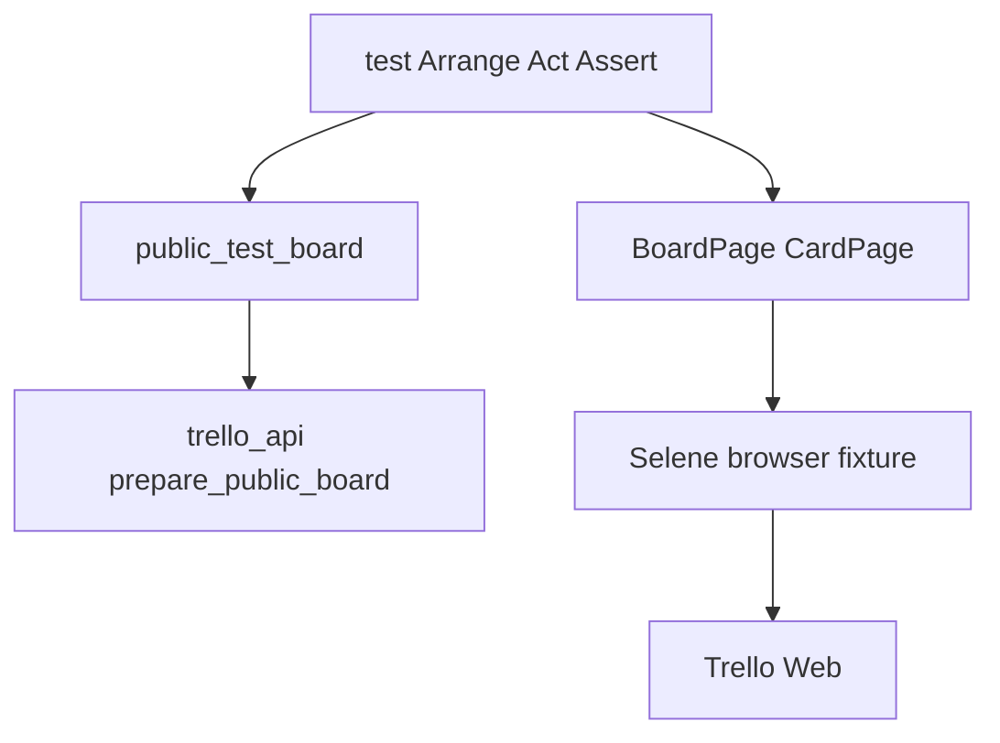

# trello_ui

UI-автотесты Trello (**Selenium + Selene**). **Без логина в браузере**: API создаёт публичные доски, тесты проверяют отображение по URL.

**Overview:** [trello](https://github.com/shadow7971247/trello) · **Архитектура:** [docs/ARCHITECTURE.md](https://github.com/shadow7971247/trello/blob/main/docs/ARCHITECTURE.md) · **CI:** [docs/CI.md](https://github.com/shadow7971247/trello/blob/main/docs/CI.md)

## Стек

- Python 3.12+
- Pytest, Selene, Selenium, Allure, python-dotenv
- [trello_api](https://github.com/shadow7971247/trello_api) рядом или `TRELLO_API_PATH` в CI

## Архитектура решения



| Слой | Где | Пример |
|------|-----|--------|
| Arrange | `conftest.public_test_board` | Создание публичной доски через API |
| Act | `pages/*` | `open_by_url()`, `open_card()` |
| Assert | `pages/*`, тест | `should_have_board_title()`, `assert board.short_url` |
| UI Engine | `conftest` + Selene | Chrome локально / Selenoid в Jenkins |
| Reporting | Allure | Шаги на русском |

### Пример теста (3A)

```python
def test_public_board_opens_by_url(public_test_board) -> None:
    board = public_test_board("Public UI")              # Arrange

    with allure.step("UI: открыть публичную доску"):  # Act
        (
            BoardPage()
            .open_by_url(board.url)
            .should_be_public_view()                    # Assert
            .should_have_board_title(board.name)
        )
```

## Установка

```bash
git clone https://github.com/shadow7971247/trello_ui.git
cd trello_ui
python -m venv .venv && .venv\Scripts\activate
pip install -r requirements.txt
copy .env.example .env
```

В `.env` — только **API key/token** (как в trello_api). Email и пароль Trello для UI **не нужны**.

### Jenkins / Selenoid

Одна переменная окружения:

```env
SELENOID_URL=http://selenoid:4444/wd/hub
```

## Запуск

```bash
pytest -m ui                 # 11 тестов (CI)
pytest -m smoke
pytest --alluredir=allure-results && allure serve allure-results
```

## Сценарии (11)

| Файл | Проверки |
|------|----------|
| `test_public_board.py` | URL, shortUrl, заголовок вкладки |
| `test_public_lists.py` | Один и несколько списков |
| `test_public_cards.py` | Карточки, архивная скрыта |
| `test_public_card_detail.py` | Ссылки `/c/`, ASCII-имена, описание |

Мутации (rename, archive, delete) — в **trello_api**.

## Структура

```
trello_ui/
├── pages/           # BoardPage, CardPage (Page Object)
├── tests/
├── ui_utils/        # screenshot, allure attach
├── api_bridge.py    # импорт trello_api
├── config.py        # UiConfig.from_env()
└── conftest.py      # browser, public_test_board (yield)
```

## CI

Jenkins stage UI: `pytest -m ui` на Selenoid. См. [JENKINS_FREESTYLE.md](https://github.com/shadow7971247/trello/blob/main/docs/JENKINS_FREESTYLE.md).
